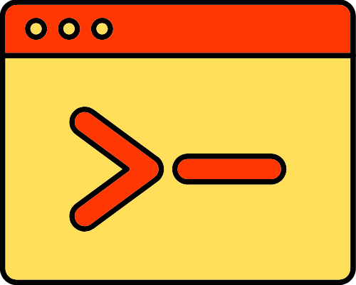

	

    

        
        
        
        
    

    <a href="https://danie1net0.github.io/laravel-commands-doc/" target="_blank">📚 Documentation</a> 

# Laravel Commands

Laravel Commands is a Laravel package designed to simplify the process of generating resources using the Artisan command line interface.

## Get Started

Please visit the [Get Started](https://danie1net0.github.io/laravel-commands-doc/guide) page for installation and usage guide.
